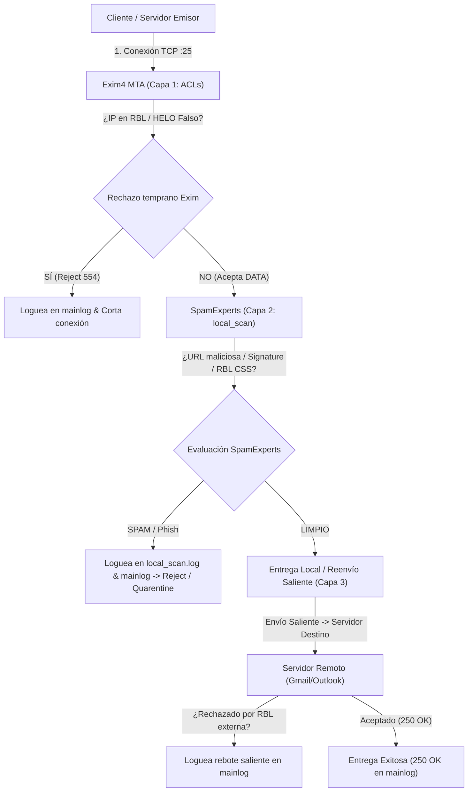

# Arquitectura y Funcionamiento de Filtrado Antispam (Exim4 + SpamExperts) 🛡️📧

Este documento explica en detalle el funcionamiento técnico del ecosistema **Exim4 (MTA) + SpamExperts (local_scan)**, las etapas del protocolo SMTP donde se evalúan los correos, por qué ocurren registros en los distintos archivos de log y cómo el script **SPAMEMONITOR** audita las listas negras (RBLs/DNSBLs).

---

## 📋 Tabla de Contenidos
1. [Flujo Global de Evaluación SMTP](#1-flujo-global-de-evaluación-smtp)
2. [Las 3 Capas de Protección y Filtrado](#2-las-3-capas-de-protección-y-filtrado)
3. [Diferencias entre Logs (`mainlog` vs `local_scan.log`)](#3-diferencias-entre-logs-mainlog-vs-local_scanlog)
4. [Ecosistema de Listas Negras y Reputación (RBLs / URIBLs)](#4-ecosistema-de-listas-negras-y-reputación-rbls--uribls)
5. [Análisis de Tráfico Entrante vs Tráfico Saliente](#5-análisis-de-tráfico-entrante-vs-tráfico-saliente)
6. [Cómo Audita SPAMEMONITOR (Opción 10)](#6-cómo-audita-spamemonitor-opción-10)
7. [Mapeo con Archivos de Registro Reales (`Ejemplo-de-logs/`)](#7-mapeo-con-archivos-de-registro-reales-ejemplo-de-logs)

---

## 1. Flujo Global de Evaluación SMTP

Cuando un servidor remoto intenta enviar un correo electrónico hacia tu infraestructura, o cuando un usuario local envía un correo hacia el exterior, la transacción atraviesa la secuencia estándar del protocolo **SMTP** (Simple Mail Transfer Protocol):



---

## 2. Las 3 Capas de Protección y Filtrado

### 🚪 Capa 1: Filtro de Conexión SMTP en Exim4 (`ACLs`)
* **Momento de ejecución:** Durante el apretón de manos inicial (`CONNECT`, `HELO/EHLO`, `MAIL FROM`, `RCPT TO`).
* **Qué evalúa Exim4:**
  - Si la IP conectada figura directamente en listas negras RBL globales (como `zen.spamhaus.org`).
  - Formato del comando HELO y existencia del registro PTR (DNS inverso).
  - Peticiones de autenticación fallidas (`login authenticator failed`).
* **Comportamiento:** Si la IP emisor es maliciosa, Exim4 la rechaza inmediatamente con un código SMTP `554` o `550` y **cierra la conexión**.

### 🧠 Capa 2: Inspección Profunda de SpamExperts (`local_scan()`)
* **Momento de ejecución:** Una vez recibido el cuerpo completo del mensaje (`DATA`).
* **Qué evalúa SpamExperts:**
  - **Reputación de IP/Red:** `sh-zen.rbl.spamrl.com`, SpamRL propio.
  - **Reputación de URLs (URIBL):** Analiza enlaces en el cuerpo/HTML del correo mediante **SURBL** (`surbl.org`) y **Invaluement** (`invaluement.com`) para detectar dominios de phishing o acortadores maliciosos (`ow.ly`, `wa.me`, etc.).
  - **Filtro de Listas Dinámicas:** Listas tipo **CSS** (Spamhaus Spam Emission List) para emisión de spam en tiempo real.
  - **Firmas Bayesianas y CRM114:** Coincidencia de patrones de texto e imágenes.
* **Comportamiento:** Si detecta anomalías, devuelve a Exim la orden de rechazar (`rejected by local_scan()`) o envía el correo al spool de cuarentena (`/var/spool/mail/w/wa/`).

### 📤 Capa 3: Servidores Remotos de Destino (Tráfico Saliente)
* **Momento de ejecución:** Cuando tu servidor antispam actúa como emisor (`=>`) enviando correo hacia proveedores externos (Gmail, Outlook, Yahoo, Zendesk, etc.).
* **Qué evalúa el destino:** El servidor receptor evalúa si la **IP local de salida de tu servidor** está reportada en RBLs o si las firmas SPF/DKIM/DMARC son válidas.
* **Comportamiento:** Si tu IP de salida está bloqueada externamente, el servidor remoto responde con error `554 / 550` y Exim4 genera una línea de rebote en `mainlog`.

---

## 3. Diferencias entre Logs (`mainlog` vs `local_scan.log`)

Es habitual notar que algunas IPs figuran en un archivo de log y no en el otro. Esto responde a la etapa donde ocurrió la acción:

| Evento / Escenario | Se registra en `exim4/mainlog` | Se registra en `spamexperts/local_scan.log` | Explicación Técnica |
| :--- | :---: | :---: | :--- |
| **Bloqueo ACL Exim4 Inicial** | ✅ **SÍ** | ❌ **NO** | Exim4 corta la conexión en la Capa 1. No se llega a invocar la función `local_scan()`. |
| **Bloqueo por SpamExperts** | ✅ **SÍ** | ✅ **SÍ** | Exim4 llama a SpamExperts en Capa 2. SpamExperts registra el motivo exacto (`DNSBL match`, `CSS`, etc.) y Exim4 registra el resultado final (`rejected by local_scan()`). |
| **Envío Saliente Exitoso** | ✅ **SÍ** (`=> 250 OK`) | ❌ **NO** | Es un envío de salida de la Capa 3. `local_scan.log` solo audita inspección entrante. |
| **Rechazo por RBL Externa en Envío Saliente** | ✅ **SÍ** (`554 Blocked`) | ❌ **NO** | Ocurre en la Capa 3. El rebote proviene de un servidor de destino de terceros. |

---

## 4. Ecosistema de Listas Negras y Reputación (RBLs / URIBLs)

El antispam evalúa diferentes fuentes según el tipo de amenaza:

| RBL / Servicio | Tipo de Análisis | Propósito y Contenido |
| :--- | :--- | :--- |
| **Spamhaus (ZEN/DBL/HBL)** | **Reputación IP y Dominio** | Principal base de datos contra botnets, servidores de correo no autorizados y remitentes masivos. |
| **Spamhaus CSS** | **Emisión de Spam Dinámica** | Sublista de Spamhaus para IPs con comportamiento agresivo o infectadas emitiendo spam en el momento. |
| **SURBL** (`surbl.org`) | **URIBL (URLs en cuerpo)** | Filtro que escanea las URLs dentro del cuerpo del mail para bloquear acortadores y sitios de phishing. |
| **Invaluement** (`invaluement.com`) | **Dominios de Alto Riesgo** | Especializado en *snowshoe spam* y dominios de spam recién registrados. |
| **SpamRL** (`spamrl.com`) | **Red Global SpamExperts** | Sistema de inteligencia colectiva propio de las instancias de SpamExperts en el mundo. |

---

## 5. Análisis de Tráfico Entrante vs Tráfico Saliente

En los logs de Exim4 se identifican fácilmente los roles mediante conectores de red:

### 📥 Tráfico Entrante (Inbound)
* **Formato en log:** `H=servidor.remoto.com [148.135.25.195] I=[45.173.0.25]:25`
* **`H=` (Host Remoto):** Es la IP externa del emisor que intenta enviarte correo.
* **`I=` (Interface Local):** La IP de tu servidor que recibe la conexión.

### 📤 Tráfico Saliente (Outbound)
* **Formato en log:** `=> usuario@destino.com ... H=mail.destino.com [34.227.209.168] I=[45.173.0.128]`
* **`=>` / `->`:** Indica envío/entrega realizada por tu servidor.
* **`I=` (Interface Local):** La IP de salida de tu servidor utilizada para la transmisión.

---

## 7. Mapeo con Archivos de Registro Reales (`Ejemplo-de-logs/`)

Los conceptos expuestos en este documento fueron validados utilizando muestras de producción extraídas durante 3 días de actividad en el servidor `antispam-01.wavenet.com`:

```text
Ejemplo-de-logs/
├── DESGLOSE-COMPLETO-LOGS.txt           # Análisis línea a línea de patrones de log
├── Reprote-spam.txt                     # Reporte consolidado de ataques
├── logs-ip-server.txt                   # Tráfico filtrado por IP local (45.173.0.25)
├── reporte-directo-unsure.txt           # Mapeos de envíos en zona gris ("unsure")
├── logs-exim4-mainlog/
│   ├── exim4-mainlog.txt                # Log principal día 1 (Día 30 Marzo)
│   ├── exim4-mainlog2.txt               # Log principal día 2 (Día 31 Marzo)
│   └── exim4-mainlog3.txt               # Log principal día 3 (Día 06 Abril)
├── logs-spamexperts-local_scan/
│   ├── spamexperts-local_scan.log.txt   # Inspección profunda SpamExperts día 1
│   ├── spamexperts-local_scan2.log.txt  # Inspección profunda SpamExperts día 2
│   └── spamexperts-local_scan3.log.txt  # Inspección profunda SpamExperts día 3
└── logs_web-antispam-experts/
    └── CSV Export OutgoingLogSearch.csv # Registros exportados de la interfaz web
```

### Ejemplos Reales Extraídos de la Muestra:

1. **Ataque de Fuerza Bruta en Capa 1 (`exim4-mainlog`):**
   ```text
   2026-04-06 00:00:45 [2810242] login authenticator failed for 157.101.169.56.static.zoot.jp ([36.154.20.34]) [157.101.169.56] I=[45.173.0.25]:465: 535 Incorrect authentication data
   ```

2. **Rechazo por RBL de URLs SURBL en Capa 2 (`exim4-mainlog` + `local_scan.log`):**
   ```text
   2026-04-06 00:14:42 [2815675] 1w9aQ8-00BoU7-Qc F=aerocesnaescuela@gmail.com H=mail-pf1-f171.google.com [209.85.210.171] I=[45.173.0.25]:25 P=esmtps rejected by local_scan(): A URL in this email (ow . ly/iuvu50XSIHi) is listed on https://www.surbl.org/lists
   ```

3. **Coincidencia Dinámica en Spamhaus CSS (`local_scan.log`):**
   ```text
   2026-09-08 00:45:04,738 INFO 1x3mLZ-0054MW-Gz DNSBL match: sh-zen.rbl.spamrl.com: 148.135.25.195 reason: CSS
   ```

4. **Entrega Saliente Limpia con Interfaz Local `I=[IP]` (Capa 3):**
   ```text
   2026-09-08 02:20:59 [1247276] 1x3oGE-005ESr-SI => support@yuhmak.zendesk.com R=dnslookup T=remote_smtp_batv H=mail.zendesk.com [34.227.209.168] I=[45.173.0.128] X=TLS1.3:TLS_AES_256_GCM_SHA384:256 CV=yes K C="250 2.0.0 OK"
   ```

