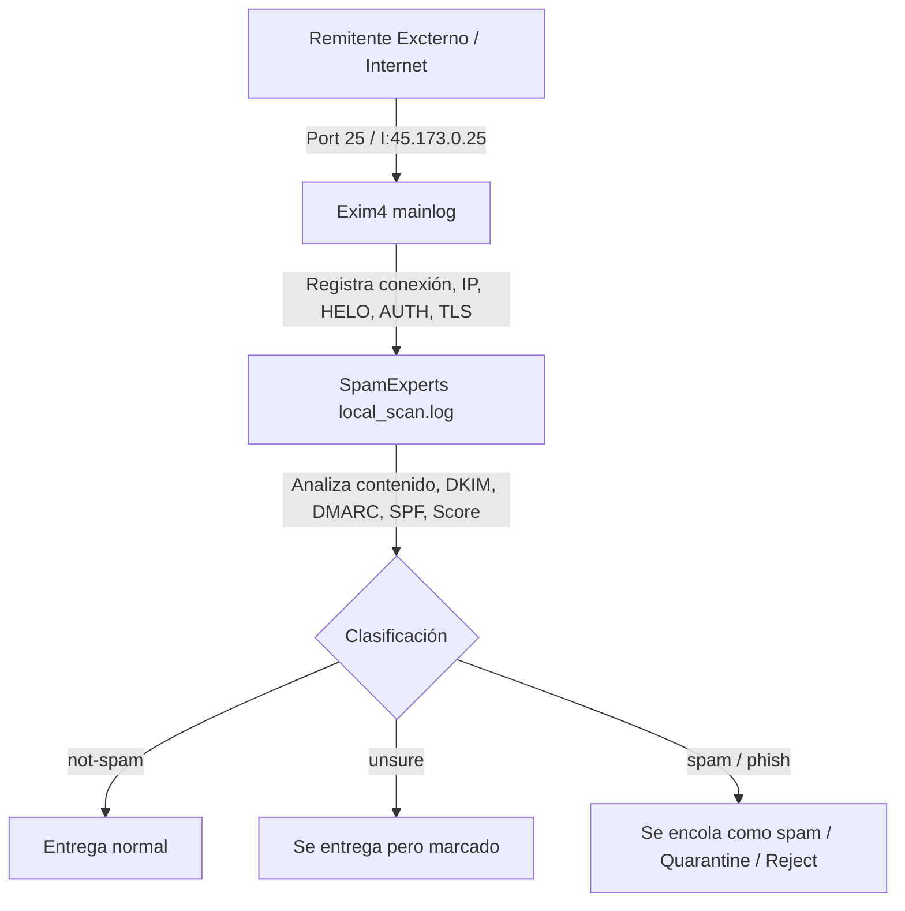
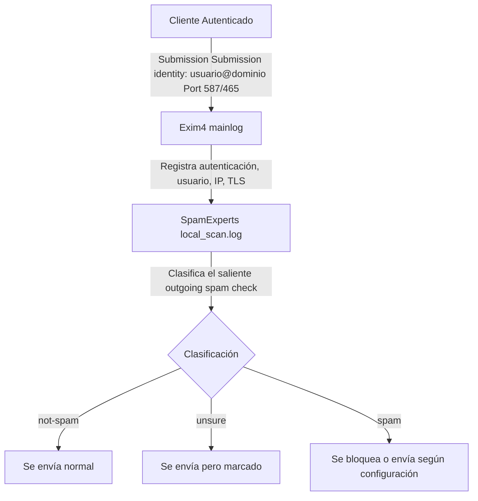

# REPORTE TÉCNICO: SPAMEMONITOR
> **Análisis completo del script y su relación con los logs del servidor antispam-01.wavenet.com**

---

## 1. Descripción General del Sistema

**SPAMEMONITOR** es un script Bash interactivo diseñado para monitorear, investigar y reportar actividad de spam en un servidor antispam que utiliza:

* **Exim4** como MTA (Mail Transfer Agent)
* **SpamExperts** como filtro antispam (`local_scan`)
* **Servidor:** `antispam-01.wavenet.com` (IP: `45.173.0.25`)
* **Red gestionada:** `45.173.0.0/24` y `45.173.1.0/24`

El script opera sobre **dos fuentes de logs principales**:

1. `/var/log/exim4/mainlog`  
   → Log principal de Exim4. Registra **todos** los eventos de correo: conexiones, autenticaciones, entregas, rechazos, errores TLS, rate limiting, verificaciones DMARC/SPF/DKIM, etc.
2. `/var/log/spamexperts/local_scan.log`  
   → Log detallado de SpamExperts. Registra el **análisis profundo** de cada mensaje: puntuaciones CRM114, DKIM, DMARC, SPF, Pyzor, Hostkarma, DNSBL, URL blacklists, heurísticas, firmas Sanesecurity, etc.

El script se conecta por SSH al servidor y se ejecuta directamente allí (copy-paste en `nano`), accediendo a los logs reales del sistema.

### Directorios y archivos analizados
* `/var/log/spamexperts/local_scan.log`
* `/var/log/exim4/mainlog`
* `/var/lib/exim4/outgoing-config.autogenerated`
* `/var/spool/mail/w/wa/`

---

## 2. Arquitectura de Flujo de Correo

Basado en el análisis de los logs, este es el flujo que monitorea el script:

### Flujo de Correo Entrante


### Flujo de Correo Saliente


---

## 3. Análisis Detallado de Cada Función del Script

---

### OPCIÓN 1: Correos Outgoings detectados como SPAM 📤

* **Función:** `outgoings_email_spam()`
* **Qué hace:** Detecta correos **SALIENTES** (*outgoing*) que SpamExperts clasificó como SPAM. Identifica qué cuentas de usuario están enviando spam desde dentro de la red gestionada.
* **Cómo funciona (paso a paso):**
  1. Busca en `/var/log/spamexperts/local_scan.log` la cadena: `"Queuing outgoing spam message"`.
  2. Usa `zgrep -B1` para obtener la línea **anterior**, que contiene `"Submission identity: usuario@dominio"`.
  3. Extrae la identidad con `awk -F': ' '{print $2}'`.
  4. Agrupa y ordena con `sort | uniq -c | sort -nr`.
* **Qué revela en los logs reales:**
  * Revela si el sistema AutoGESTION u otras cuentas generan correos automáticos o si una cuenta legítima fue comprometida.
* **Caso de uso real:** Si un usuario de `wavenet.com.ar` tiene su cuenta comprometida y empieza a enviar spam masivo, la opción 1 la muestra con un conteo elevado.

---

### OPCIÓN 2: Correos Incomings detectados como SPAM 📥

* **Función:** `incomings_email_spam()`
* **Qué hace:** Detecta correos **ENTRANTES** (*incoming*) que SpamExperts clasificó como SPAM. Muestra qué destinatarios están recibiendo más spam.
* **Cómo funciona (paso a paso):**
  1. Busca en `/var/log/spamexperts/local_scan.log` la cadena `"Queuing incoming spam message"`.
  2. Extrae los destinatarios con `awk -F'for ' '{print $2}'`.
  3. Separa múltiples destinatarios con `tr ',' '\n'`.
  4. Limpia espacios y puntos finales con `sed 's/[[:space:]]//g; s/\.$//'`.
  5. Filtra solo direcciones de email con `grep '@'`.
  6. Permite buscar un email específico o presionar Enter para ver todos.
  7. Agrupa y ordena por cantidad.
* **Caso de uso real:** Identificar buzones atacados para ajustar filtros o políticas SPF/DMARC.

---

### OPCIÓN 3: Dominios Incomings detectados como SPAM 🌐📥

* **Función:** `incomings_domain_spam()`
* **Qué hace:** Similar a la opción 2, pero en lugar de emails individuales, muestra **DOMINIOS** completos que reciben spam entrante.
* **Cómo funciona (paso a paso):**
  1. Misma búsqueda y extracción que opción 2.
  2. **Diferencia clave:** `grep -v '@'` para aislar dominios sin dirección específica de usuario.
  3. Soporta buscador flexible por substring.
* **Caso de uso real:** Detectar ataques masivos a dominios enteros (`wavenet.com.ar`, `emba.com.ar`, `yuhmak.com.ar`).

---

### OPCIÓN 4: Correos Outgoings detectados como UNSURE 📤

* **Función:** `unsure_outgoings_email_spam()`
* **Qué hace:** Detecta correos **SALIENTES** clasificados como `"unsure"` (incierto). Es la zona gris entre spam y legítimo.
* **Cómo funciona (paso a paso):**
  1. Busca `"main: unsure"` en `local_scan.log`.
  2. Obtiene la línea siguiente (`zgrep -A1`) con `"Submission identity"`.
  3. Permite filtrado por substring de email/dominio.
* **Qué revela en los logs reales:**
  * Caso crítico hallado: `autogestion@civiles.org.ar` generaba múltiples mensajes *unsure* por falta de firma DKIM y asuntos de error genéricos.
* **Solución recomendada:** Whitelist o configuración de DKIM en el servidor emisor.

---

### OPCIÓN 5: Lista completa de correos enviados 📨

* **Función:** `filter_exim_by_sender()`
* **Qué hace:** Analiza `/var/log/exim4/mainlog` para listar **todos** los remitentes que enviaron correo, ordenados por volumen.
* **Cómo funciona (paso a paso):**
  1. Parsea el `mainlog` usando `awk` en modo `IGNORECASE=1`.
  2. Extrae ID de mensaje y remitente con regex (`<=`, `MAIL FROM:<...>`, `F=...`).
  3. Mantiene mapa de relación `sender[id] = from`, excluye bounces (`<>`).
  4. Agrupa, cuenta y lista top 100 de remitentes.

---

### OPCIÓN 6: Correos ENTRANTES desde IP 📥📍

* **Función:** `filter_exim_incoming_by_ip()`
* **Qué hace:** Busca correos entrantes recibidos desde una IP específica.
* **Cómo funciona:**
  1. Pide la IP a buscar.
  2. Filtra líneas de recepción ` <= ` con `H=hostname [IP]`.
  3. Muestra remitentes y cantidad de mensajes provenientes de dicha IP.

---

### OPCIÓN 7: Correos SALIENTES por IP 📤📍

* **Función:** `filter_exim_outgoing_by_ip()`
* **Qué hace:** Busca correos salientes enviados a través de una interfaz IP local específica (`I=[IP]`).
* **Cómo funciona:**
  1. Pasada 1: Mapea `ID -> Remitente` desde las líneas ` <= `.
  2. Pasada 2: Mapea entregas ` => ` con `I=[IP]` e invoca la identidad emisor.
* **Diferencia clave:** Opción 6 evalúa IP emisor remoto (`H=`), Opción 7 evalúa interfaz de salida local (`I=`).

---

### OPCIÓN 8: Ver correo en cuarentena por Message ID 🔍🛡️

* **Función:** `search_quarantined_mails()`
* **Qué hace:** Busca un mensaje por su Message ID en el spool de cuarentena (`/var/spool/mail/w/wa/`).
* **Cómo funciona:** Almacena los resultados de `grep -Rl` en un array de Bash, los presenta en un menú interactivo numerado (`1)`, `2)`, `3)`...) y permite abrir cualquier archivo seleccionado con `cat`.

---

### OPCIÓN 9: Ver todos los mensajes en cola de envío 📬⏳

* **Función:** `show_exim_queue()`
* **Qué hace:** Consulta la cola de mensajes en espera usando `exim -C "$CONFIG" -bp`.
* **Útil para:** Diagnosticar bloqueos por timeouts, IPv6 inalcanzables o estados *frozen*.

---

### OPCIÓN 10: IPs en Blacklists (RBLs) 📍🚫

* **Función:** `check_blacklist_drops()`
* **Qué hace:** Permite consultar una IP específica (remota o IP de interfaz local de salida del propio servidor) en busca de bloqueos en RBLs o generar el reporte Top 10 general.
* **Modos de funcionamiento:**
  1. **Auditoría por IP:**
     - Filtra eventos adversos en `mainlog` y `local_scan.log` exigiendo términos de rechazo explícitos (`rejected`, `listed on`, `RBL`, `spamhaus`, `spamrl`, `surbl`, `invaluement`).
     - **Manejo de IPs Locales de Salida:** Ignora por completo entregas salientes exitosas de tu propio servidor (líneas con `=>` o `->` y respuestas `250 OK`), evitando falsos positivos cuando se consulta la IP local `I=[IP]`.
     - **Detección de Rebotes Reales:** Registra únicamente situaciones donde la IP fue rechazada o bloqueada por un servidor de destino debido a una blacklist, detallando fecha, destinatario y motivo.
     - Si no existen bloqueos, confirma estado limpio en verde.
  2. **Reporte General (Enter):** Genera el Top 10 de bloqueos desglosado en:
     - **Spamhaus (ZEN/DBL/HBL):** Reputación de IP/Dominio.
     - **SURBL:** URLs maliciosas embebidas en el mensaje (ej: acortadores `ow.ly`, `wa.me`).
     - **Invaluement:** Dominios/URLs de alto riesgo (*snowshoe spam*).
     - **SpamRL / Otras:** Firmas dinámicas y RBLs adicionales.
     - **Resumen:** Totales cuantitativos globales.

---

## 4. Resumen de Funcionalidades por Categoría

| Categoría | Opción | Qué detecta | Fuente de log | Acción posible |
|---|---|---|---|---|
| **Spam Detection** | 1 | Spam saliente por cuenta | `local_scan` | Bloquear cuenta, cambiar credenciales |
| | 2 | Spam entrante por email | `local_scan` | Filtrar, revisar DNS/DMARC |
| | 3 | Spam entrante por dominio | `local_scan` | Revisar registros SPF/DMARC del dominio |
| | 4 | Unsure saliente por cuenta | `local_scan` | Whitelist, implementar DKIM |
| **Mail Management** | 5 | Volumen por remitente | `exim4/mainlog` | Detectar cuentas descontroladas/comprometidas |
| | 6 | Correos entrantes por IP | `exim4/mainlog` | Investigar reputación de IP externa |
| | 7 | Correos salientes por IP | `exim4/mainlog` | Rastrear interfaz de salida usada |
| | 8 | Mensajes en cuarentena | filesystem | Inspeccionar / liberar falsos positivos |
| | 9 | Cola de envío | exim queue | Diagnosticar diferimientos o fallos SMTP |
| **Blacklists** | 10 | IPs en RBLs | `exim4/mainlog`, `local_scan` | Solicitar delisting / bloqueo de rangos |

---

## 5. Patrones de Ataque Detectables

1. **Brute-force de credenciales SMTP:** Fallos reiterados de autenticación (`login authenticator failed`).
2. **Spam desde VPS comprometidos:** Invasiones desde rangos específicos (ej. `vps*.falesiaho.com` en IPs `194.38.20.x`).
3. **Red de spam recurrente:** Múltiples IPs asociadas a un mismo dominio (`nugetcenter.com`).
4. **Ráfagas persistentes:** Reintentos simultáneos y recurrentes desde una IP (`giize.com`).
5. **Phishing entrante:** Reglas `antispamcloud.phish.genphs` activadas.
6. **Falsos positivos por falta de DKIM:** Entradas `unsure` recurrentes de sistemas automatizados (`autogestion@civiles.org.ar`).
7. **Búsqueda/Scanning de buzones:** Rechazos `User unknown` con HELO falsificados.
8. **Spam con URLs listadas en DBL/HBL:** Mensajes entrantes con enlaces a dominios maliciosos (`instatool.site`, `mobwebify.com`).

---

## 6. Flujo de Investigación Recomendado

```
PASO 1: ¿Hay spam saliente? (cuentas comprometidas)
  ├─► Opción 1: Spam saliente confirmado
  ├─► Opción 4: Unsure saliente (zona gris)
  └─► Opción 5: Volumen general de envío

PASO 2: ¿Hay spam entrante? (ataques externos)
  ├─► Opción 2: Spam por email destinatario
  └─► Opción 3: Spam por dominio

PASO 3: ¿De dónde viene el spam? (investigar origen)
  ├─► Opción 6: Buscar correos entrantes desde IP sospechosa
  └─► Opción 10: Ver si la IP está en blacklists

PASO 4: ¿Hay mensajes retenidos? (recuperar falsos positivos)
  ├─► Opción 8: Buscar en cuarentena por Message ID
  └─► Opción 9: Ver cola de envío (mensajes atascados)
```

---

## 7. Limitaciones y Mejoras Posibles

### Limitaciones Actuales
1. No detalla puntuaciones numéricas profundas (scores CRM114) ni firmas en el output final de todas las opciones.
2. Requiere correlación manual entre `mainlog` y `local_scan.log` para análisis de un Message ID específico.
3. No ofrece vista temporal (ej: "últimas 2 horas").
4. La búsqueda en cuarentena requiere conocer previamente el Message ID exacto.

### Mejoras Sugeridas
1. **Detección automática de Brute-Force:** Función para agregar conteo de `login authenticator failed` por IP.
2. **Monitor de Rate Limiting:** Detección de eventos `is sending too fast`.
3. **Correlador por Message ID:** Comando que consulte ambos logs simultáneamente dado un ID.
4. **Detector de candidatos a Whitelist:** Identificación automática de remisores legítimos en estado `unsure`.

---

## 8. Conclusión

**SPAMEMONITOR** es una herramienta ligera, eficaz e indispensable para administradores de sistemas a cargo de infraestructura Exim4 + SpamExperts. Al operar directamente sobre los archivos de log locales sin dependencias adicionales, permite responder en tiempo real ante cuentas comprometidas, ataques de fuerza bruta y bloqueos RBL.

---
*Reporte consolidado a partir de la infraestructura de `antispam-01.wavenet.com`.*
